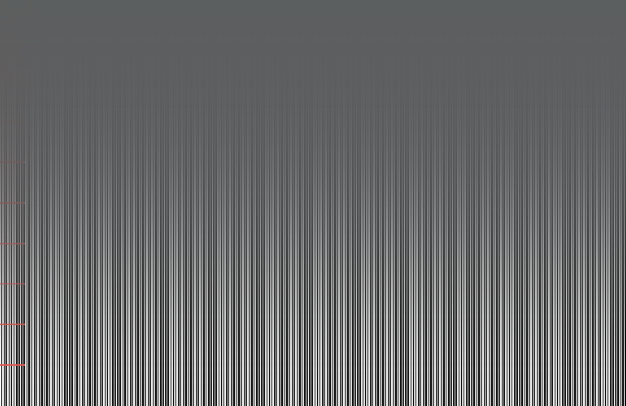

# MacBookUno

**Your MacBook's screen folds as you close the lid.**

A macOS menu bar app that reads the real hinge-angle sensor and reshapes the
display as the lid comes down — either frosting it over, or tipping the desktop
away on a plane of its own.

Inspired by the iPhone Duo's folding animation — where the moving flap behaves
like frosted glass laid over a screen that is already there — adapted to a
laptop's single-panel display.

[](https://github.com/orknkrc/MacBookUno/actions/workflows/ci.yml)


> Built from scratch with Apple frameworks only (IOKit, AppKit, Foundation).
> No third-party packages, no vendored code, no private API.

---

## What it does

- Reads the lid angle from the built-in HID sensor, ~0.01° resolution.
- Above a threshold angle (default 60°) nothing happens at all.
- Below it, the effect tracks the hinge angle directly. At 0° it is at full
  strength.
- Two styles, chosen from the menu:
  - **Frosted Glass** (default) — a frosted ramp sweeps across the display.
    Asks for no permissions.
  - **Fold Plane** — the desktop keeps its own angle while the panel turns
    around it, the way the reference animation behaves. Needs Screen Recording.
- Clicks, scrolling and the cursor pass straight through. The overlay is never
  interactive.
- Internal display only. External monitors are left alone.

## Requirements

- A MacBook with a lid angle sensor. Apple ships this as a HID device with
  vendor `0x05AC`, product `0x8104`, usage page `0x0020` (Sensor), usage
  `0x008A` (Orientation).
- macOS 14 or later. Verified on macOS 26.6 / `Mac17,9` (Apple silicon).
  `ScreenCaptureKit`'s `SCScreenshotManager`, used by the Fold Plane style, is
  a macOS 14 API; the Frosted Glass style itself would run on macOS 13.
- Screen Recording permission, **only** for the Fold Plane style. The app asks
  on first use and offers to fall back to Frosted Glass if you decline.

Check whether your Mac has the sensor before building anything:

```bash
hidutil list | grep -i 8104
```

No output means this Mac does not have the sensor, and the app will tell you so
on launch rather than failing silently.

## Install

```bash
git clone https://github.com/orknkrc/MacBookUno.git
cd MacBookUno
./Scripts/make-app.sh
open build/MacBookUno.app
```

A laptop icon appears in the menu bar. To quit: menu bar icon → **Quit**, or
`pkill -x MacBookUno`.

To launch it at login, use **Open at Login** in the menu. macOS may ask you to
allow it under System Settings → General → Login Items the first time.

For development you can skip the bundle entirely:

```bash
swift run MacBookUno
```

## Usage

Everything lives in the menu bar item:

| Menu item | What it does |
| --- | --- |
| Angle | Live raw and smoothed angle |
| Fold | Current fold amount |
| Effect Enabled | Toggle the effect; the overlay is removed when off |
| Threshold Angle | 20°–120° presets, persisted |
| Sweep Direction | From the hinge upward, or from the top downward |
| Animation Style | Frosted Glass or Fold Plane |
| Preview | A slider that drives the effect from a pretend angle |
| Open at Login | Register the app with `SMAppService` |
| Status | Whether the sensor is being read, and from which field |
| Quit | Exit |

### Seeing the effect without moving the lid

With the default 60° threshold and normal use between 85° and 132°, nothing
happens while you work — that is the intended behavior.

The easiest way to see it, and the only practical way to tune it, is the
**Preview** slider in the menu: it feeds the effect a pretend angle, so you can
watch the fold at 40° while the lid is wide open and the screen is readable.
**Follow the Lid** hands control back to the sensor.

The same thing is available from the command line:

```bash
swift run MacBookUno -- --sweep        # animate the angle up and down
swift run MacBookUno -- --simulate 30  # hold a fixed angle
swift run MacBookUno -- --log          # print angle and fold amount
swift run MacBookUno -- --pattern      # striped backdrop for measuring the ramp
swift run MacBookUno -- --style plane  # pick a style for this run
swift run MacBookUno -- --capture-test /tmp/f.png   # one frame, then exit
```

`--capture-test` grabs a single frame, writes it out and exits. It is the
quickest way to tell a Screen Recording problem apart from a rendering one.

### `lidangle` — the sensor CLI

A separate command line tool for inspecting the sensor directly. Useful for
porting to a MacBook whose sensor differs.

```bash
swift run lidangle --probe       # which read paths work on this Mac
swift run lidangle --descriptor  # parse and print the HID report descriptor
swift run lidangle --fine --poll # live angle at the finest resolution
swift run lidangle --help
```

## How it works

### Reading the sensor

The angle is **not** a feature report, despite what most write-ups on this
sensor claim. On a `Mac17,9` the report descriptor contains no feature items at
all (`MaxFeatureReportSize = 1`). The angle arrives as an **input report**:

```
05 20        Usage Page (Sensor)
09 8A        Usage (Orientation)
A1 01        Collection (Application)
85 01          Report ID (1)
0A 7F 04       Usage (0x047F)
26 68 01       Logical Maximum (360)
14             Logical Minimum (0)
75 09          Report Size (9 bit)
81 02          Input (Data,Var,Abs)
```

There is also a **Report ID 7**: 50 bits declared, logical 0–36000 with unit
exponent −2, i.e. 0.00–360.00 degrees. That is the field the app uses, because
Report ID 1 only gives whole degrees.

Bit offsets are never hard-coded. `HIDReportDescriptor` parses the device's own
descriptor and `LidAngleSensor` picks the angle field out of it, so the code has
a chance of working on models where the layout differs.

### The Frosted Glass style

The first version blurred the whole screen uniformly, and it looked nothing like
the reference. Watching the folding animation closely, the blur is not uniform
and it is not a bounded region with a visible edge either: the blur **strength
varies continuously across the panel**, heaviest where the surface is turning
away from you and fading to sharp where it still faces you.

So intensity is not `alphaValue` — it is spatial, via
`NSVisualEffectView.maskImage`. `FoldMask` generates a bitmap whose alpha
channel is a ramp spanning the full panel height, and the whole ramp slides as
the lid moves. The position tracks the lid angle **linearly** on purpose; easing
it would make the effect drift ahead of or behind the lid instead of moving with
it.

`NSVisualEffectView` gives no public control over blur radius, so a single pass
leaves large shapes (window edges, the Dock silhouette) readable. Two additions
fix that: a second `.withinWindow` effect view stacked on top, which blurs what
the first pass drew into the window, and a faint light wash over the ramp —
real frosted glass scatters light rather than only blurring, and without the
wash the result keeps too much contrast to read as glass.

The overlay pins itself to the dark appearance. `NSVisualEffectView` materials
are appearance-aware, so left to follow the system the fold would look like two
different effects depending on the user's theme.

### The Fold Plane style

Frosted Glass can only ever be a filter laid over the screen. The reference
animation is not a filter: the content appears to **hold its own angle** while
the panel rotates around it. An overlay cannot do that, because it cannot
reshape what is behind it. The only way is to draw the content ourselves.

So this style captures the internal display with `ScreenCaptureKit` and puts the
result on a `CALayer` it can rotate. `CATransform3D` supplies the perspective
(`m34 = -1/1400`) and the plane leans back up to 55° — a full 90° would turn it
edge-on and hide it, and the reference keeps the content readable throughout.

The feed is a live `SCStream`, not a screenshot. A frozen frame was tried and is
unusable: the effect starts while the lid is still at a working angle, so a
still image leaves you looking at a photograph of your desktop while clicks pass
through to the real thing underneath. Measured ~48 fps.

One gradient drives everything — the blur, the softness of the plane's own
border, the shading that darkens the far end, and the shape of the dark it folds
into. They are built from the same ramp so they arrive together and cannot drift
apart.

Three findings did most to shape it:

- **`CALayer.backgroundFilters` does nothing** on a modern compositor. It would
  have filtered the desktop directly, with no capture and no permission at all.
  The filter is retained and never applied — measured, not assumed.
- **`CALayer.mask` and `CALayer.filters` are mutually exclusive.** A layer with
  both silently drops the filter. The spatial blur therefore comes from Core
  Image's `CIMaskedVariableBlur` rather than a layer mask.
- **Core Image works in a linear colour space.** A contrast of 0.98, meant to
  sell the glass, pivots dark pixels about linear 0.5 and put a uniform +15/255
  white haze over the whole screen.

The rest — why the void is cut to the plane's outline rather than filled flat,
why the plane is dissolved rather than switched off, and how any of it was
measured — is in **[docs/fold-plane.md](docs/fold-plane.md)**.

Cost: about **3.5% CPU** while the plane is on screen, against 0.2% idle. It
only runs below the threshold angle.

### A measured gotcha in `maskImage`

`NSVisualEffectView.maskImage` does **not** stretch the image to the view. It
maps it onto the backing store pixel for pixel, aligned to the top. Generate the
mask in points and on a Retina display the gradient gets squeezed into the top
half of the screen.

This was measured, not guessed. `--pattern` lays a vertically striped backdrop
under the overlay, and a per-row sharpness profile reads the mask position
directly. The numbers below were taken with a deliberately narrow ramp (0.18 of
the height) so that a single boundary position could be read off precisely:

| Mask height | Expected boundary | Measured |
| --- | --- | --- |
| 512 px (fixed) | 0.50 | 0.86 |
| 982 px (view height in points) | 0.50 | 0.75 |
| 1964 px (view height in pixels) | 0.50 | **0.50** |

Both wrong values match the "consumed in pixels, top-aligned" model exactly
(512/1964 = 0.26 → boundary 0.87; 982/1964 = 0.50 → boundary 0.75). The fix is
to build the mask at `bounds.height * backingScaleFactor`.



*The `--pattern` backdrop at 50% fold. The stripes dissolve completely at the
top and emerge continuously toward the bottom — the blur strength is a ramp
across the panel, not a region with an edge.*

### Keeping it smooth

The sensor updates at roughly **10 Hz**, and while the lid closes at a normal
speed consecutive samples differ by 2–3 degrees. Driving the effect straight
from that produces a visible stair-step ten times a second. Three things fix it:

1. **Report ID 7** (0.01° steps) instead of Report ID 1 (1° steps).
2. **Median-of-3 prefilter**, which absorbs single-sample noise spikes entirely.
3. **Time-based exponential smoothing** (120 ms), advanced on every frame of a
   60 Hz loop, so the 10 Hz steps dissolve across the frames in between.

Changes larger than 45° are treated as real motion and followed immediately, so
waking from sleep snaps rather than crawling.

Measured effect: the largest frame-to-frame jump in fold amount drops from
**6.24% to 1.43%**. A `50, 50, 50, 12, 50, 50, 50` input comes out of the median
filter unchanged.

Sensor reads happen on a background `DispatchQueue` at 30 Hz so synchronous
IOKit calls never block the main thread.

## Why App Sandbox is off

A sandboxed app cannot reach IOKit HID devices. The only HID-related sandbox
entitlements are `com.apple.security.device.usb` and
`com.apple.security.device.bluetooth`, and this sensor is an internal device on
the **SPU** transport — neither USB nor Bluetooth. There is no entitlement that
covers it, so `IOHIDDeviceOpen` would fail with `kIOReturnNotPermitted` inside
the sandbox.

`Scripts/make-app.sh` therefore ships **no entitlements file**. Verify with:

```bash
codesign -d --entitlements - build/MacBookUno.app
```

`com.apple.security.app-sandbox` should not appear. CI fails the build if it
ever does. The cost is that the app cannot be distributed through the Mac App
Store.

## Screen Recording and code signing

Only the Fold Plane style needs Screen Recording. macOS remembers that grant
against the app's **code signature**, which matters while developing: an ad-hoc
signature is a hash of the binary, so every rebuild looks like a different app
and the permission is asked for again.

`Scripts/make-app.sh` signs with a real identity when it finds one and falls
back to ad-hoc otherwise. To create one:

1. Open `/System/Library/CoreServices/Applications/Keychain Access.app` (it is
   no longer in Utilities).
2. **Keychain Access → Certificate Assistant → Create a Certificate…**, identity
   type *Self Signed Root*, certificate type *Code Signing*.
3. Double-click the new certificate → **Trust** → *Always Trust*. Without this
   step `security find-identity -v -p codesigning` reports it as
   `CSSMERR_TP_NOT_TRUSTED` and the script will not see it.

```bash
security find-identity -v -p codesigning   # should list your certificate
CODESIGN_IDENTITY="My Certificate" ./Scripts/make-app.sh
```

The designated requirement then becomes `identifier … and certificate leaf = …`
instead of a bare `cdhash`, and the grant survives rebuilds. If a stale ad-hoc
grant is already recorded, clear it once with
`tccutil reset ScreenCapture com.orknkrc.macbookuno`.

**None of this applies to people who install a release build.** Their binary
never changes, so they grant the permission once. A Developer ID signature plus
notarization would additionally remove the first-launch Gatekeeper warning.

Note that `swift run MacBookUno` is a different case again: the SwiftPM binary
is unsigned, and the permission is attributed to the terminal or IDE that
launched it. Test the Fold Plane style through `build/MacBookUno.app`.

## Limitations

- **Frosted Glass cannot reshape content.** It is a filter over the screen, so
  it can vary blur across the panel but never tip the desktop away. That is what
  the Fold Plane style is for, and it is the reason that style needs a
  permission the other one does not.
- **The lean is capped at 55°.** Past that the plane turns close to edge-on and
  the content stops being readable, which is not what the reference does.
- **The sweep direction is an interpretation.** A laptop has no crease and no
  separate flap, so both directions are offered in the menu rather than one
  being declared correct.
- **The animation was never seen first-hand.** The adaptation is based on
  published descriptions of the iPhone Duo fold, not the animation itself.
- Closing the lid fully puts the Mac to sleep, so the last few degrees can never
  be visible on screen.

## Versioning

[Semantic Versioning](https://semver.org). The version lives in a single place,
`Sources/LidAngleKit/Version.swift`; `Scripts/make-app.sh` reads it from there to
fill in the bundle's `Info.plist`, so the binary and the bundle cannot drift
apart.

```bash
swift run MacBookUno -- --version
swift run lidangle --version
```

Releases are tagged `vMAJOR.MINOR.PATCH`. See [CHANGELOG.md](CHANGELOG.md).

## Project layout

```
Sources/
  LidAngleKit/                  UI-independent sensor layer (no AppKit)
    HIDReportDescriptor.swift   HID descriptor parser + bit extraction
    LidAngleSensor.swift        Device discovery, open, read, streaming
    LidAngleMonitor.swift       Background polling, thread-safe angle
    AngleSmoother.swift         Median-of-3 + exponential smoothing
    LidAngleError.swift         Actionable error messages
  lidangle/                     Sensor inspection CLI
  MacBookUno/                   Menu bar app (AppKit)
    FoldOverlayWindow.swift     Borderless, transparent, click-through window
    FoldStyle.swift             Style enum + renderer protocol
    BlurFoldStyle.swift         Frosted Glass, permission-free
    PlaneFoldStyle.swift        Fold Plane, captured desktop on a leaning plane
    ScreenCapture.swift         ScreenCaptureKit one-shot and live stream
    FoldMask.swift              Gradient mask for the frosted region
    FoldPreview.swift           In-menu slider that fakes an angle
    LoginItem.swift             SMAppService registration
    FoldController.swift        Angle -> progress mapping, 60 Hz frame loop
    PatternBackdrop.swift       --pattern measurement backdrop
Scripts/make-app.sh             Builds MacBookUno.app
docs/fold-plane.md              How the Fold Plane works, and the measurements
```

`LidAngleKit` never imports AppKit and knows nothing about displays, so it can
be reused on its own.

## Credits and license

Inspired by the folding animation of Apple's iPhone Duo. This is an independent
project, not affiliated with or endorsed by Apple. Apple, MacBook and iPhone are
trademarks of Apple Inc.

The vendor/product IDs and HID usage values for the lid angle sensor were first
surfaced by the community. Everything in this repository was re-verified against
the device itself and written from scratch.

Licensed under the [MIT License](LICENSE), © 2026 Orkun Karaca.
There are no third-party dependencies, so no additional license terms apply.
