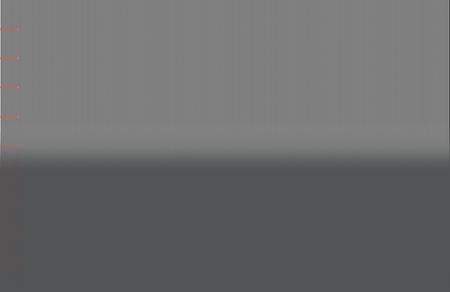

# MacBookUno

**Your MacBook's screen frosts over as you close the lid.**

A macOS menu bar app that reads the real hinge-angle sensor and sweeps a pane of
frosted glass across the display as the lid comes down.

Inspired by the iPhone Duo's folding animation — where the moving flap behaves
like frosted glass laid over a screen that is already there — adapted to a
laptop's single-panel display.


> Built from scratch with Apple frameworks only (IOKit, AppKit, Foundation).
> No third-party packages, no vendored code, no private API.

---

## What it does

- Reads the lid angle from the built-in HID sensor, ~0.01° resolution.
- Above a threshold angle (default 60°) nothing happens at all.
- Below it, a frosted-glass region sweeps across the internal display, tracking
  the hinge angle directly. At 0° the whole screen is frosted.
- Clicks, scrolling and the cursor pass straight through. The overlay is never
  interactive.
- Internal display only. External monitors are left alone.

## Requirements

- A MacBook with a lid angle sensor. Apple ships this as a HID device with
  vendor `0x05AC`, product `0x8104`, usage page `0x0020` (Sensor), usage
  `0x008A` (Orientation).
- macOS 13 or later. Verified on macOS 26.6 / `Mac17,9` (Apple silicon).

Check whether your Mac has the sensor before building anything:

```bash
hidutil list | grep -i 8104
```

No output means this Mac does not have the sensor, and the app will tell you so
on launch rather than failing silently.

## Install

```bash
git clone https://github.com/orknkrc/MacBookUno.git
cd MacBookUno
./Scripts/make-app.sh
open build/MacBookUno.app
```

A laptop icon appears in the menu bar. To quit: menu bar icon → **Quit**, or
`pkill -x MacBookUno`.

To launch it at login, add `build/MacBookUno.app` under
System Settings → General → Login Items.

For development you can skip the bundle entirely:

```bash
swift run MacBookUno
```

## Usage

Everything lives in the menu bar item:

| Menu item | What it does |
| --- | --- |
| Angle | Live raw and smoothed angle |
| Fold | Current fold amount |
| Effect Enabled | Toggle the effect; the overlay is removed when off |
| Threshold Angle | 20°–120° presets, persisted |
| Sweep Direction | From the hinge upward, or from the top downward |
| Status | Whether the sensor is being read, and from which field |
| Quit | Exit |

### Seeing the effect without moving the lid

With the default 60° threshold and normal use between 85° and 132°, nothing
happens while you work — that is the intended behavior. To actually see it:

```bash
swift run MacBookUno -- --sweep        # animate the angle up and down
swift run MacBookUno -- --simulate 30  # hold a fixed angle
swift run MacBookUno -- --log          # print angle and fold amount
```

### `lidangle` — the sensor CLI

A separate command line tool for inspecting the sensor directly. Useful for
porting to a MacBook whose sensor differs.

```bash
swift run lidangle --probe       # which read paths work on this Mac
swift run lidangle --descriptor  # parse and print the HID report descriptor
swift run lidangle --fine --poll # live angle at the finest resolution
swift run lidangle --help
```

## How it works

### Reading the sensor

The angle is **not** a feature report, despite what most write-ups on this
sensor claim. On a `Mac17,9` the report descriptor contains no feature items at
all (`MaxFeatureReportSize = 1`). The angle arrives as an **input report**:

```
05 20        Usage Page (Sensor)
09 8A        Usage (Orientation)
A1 01        Collection (Application)
85 01          Report ID (1)
0A 7F 04       Usage (0x047F)
26 68 01       Logical Maximum (360)
14             Logical Minimum (0)
75 09          Report Size (9 bit)
81 02          Input (Data,Var,Abs)
```

There is also a **Report ID 7**: 50 bits declared, logical 0–36000 with unit
exponent −2, i.e. 0.00–360.00 degrees. That is the field the app uses, because
Report ID 1 only gives whole degrees.

Bit offsets are never hard-coded. `HIDReportDescriptor` parses the device's own
descriptor and `LidAngleSensor` picks the angle field out of it, so the code has
a chance of working on models where the layout differs.

### The fold effect

The first version blurred the whole screen uniformly, and it looked nothing like
the reference. The point of the Duo animation is that the blur is a *region*:
the moving flap is frosted, its boundary slides with the hinge, and the content
behind it stays put.

So intensity is not `alphaValue` — it is spatial, via
`NSVisualEffectView.maskImage`. `FoldMask` generates a bitmap whose alpha
channel is a vertical gradient: opaque inside the frosted region, clear outside,
with a smoothstep band (18% of screen height) between them. The boundary
position tracks the lid angle **linearly** on purpose; easing it would make the
boundary drift ahead of or behind the lid instead of moving with it.

A very faint white band (alpha ≤ 0.13) rides the leading edge, because a mask
can only say *where* the blur applies — it cannot add the highlight a real glass
edge would catch.

### A measured gotcha in `maskImage`

`NSVisualEffectView.maskImage` does **not** stretch the image to the view. It
maps it onto the backing store pixel for pixel, aligned to the top. Generate the
mask in points and on a Retina display the gradient gets squeezed into the top
half of the screen.

This was measured, not guessed. `--pattern` lays a vertically striped backdrop
under the overlay, and a per-row sharpness profile reads the boundary position
directly:

| Mask height | Expected boundary | Measured |
| --- | --- | --- |
| 512 px (fixed) | 0.50 | 0.86 |
| 982 px (view height in points) | 0.50 | 0.75 |
| 1964 px (view height in pixels) | 0.50 | **0.50** |

Both wrong values match the "consumed in pixels, top-aligned" model exactly
(512/1964 = 0.26 → boundary 0.87; 982/1964 = 0.50 → boundary 0.75). The fix is
to build the mask at `bounds.height * backingScaleFactor`.



*The `--pattern` backdrop at 50% fold: sharp stripes above the boundary,
frosted below, with the soft transition in between.*

### Keeping it smooth

The sensor updates at roughly **10 Hz**, and while the lid closes at a normal
speed consecutive samples differ by 2–3 degrees. Driving the effect straight
from that produces a visible stair-step ten times a second. Three things fix it:

1. **Report ID 7** (0.01° steps) instead of Report ID 1 (1° steps).
2. **Median-of-3 prefilter**, which absorbs single-sample noise spikes entirely.
3. **Time-based exponential smoothing** (120 ms), advanced on every frame of a
   60 Hz loop, so the 10 Hz steps dissolve across the frames in between.

Changes larger than 45° are treated as real motion and followed immediately, so
waking from sleep snaps rather than crawling.

Measured effect: the largest frame-to-frame jump in fold amount drops from
**6.24% to 1.43%**. A `50, 50, 50, 12, 50, 50, 50` input comes out of the median
filter unchanged.

Sensor reads happen on a background `DispatchQueue` at 30 Hz so synchronous
IOKit calls never block the main thread.

## Why App Sandbox is off

A sandboxed app cannot reach IOKit HID devices. The only HID-related sandbox
entitlements are `com.apple.security.device.usb` and
`com.apple.security.device.bluetooth`, and this sensor is an internal device on
the **SPU** transport — neither USB nor Bluetooth. There is no entitlement that
covers it, so `IOHIDDeviceOpen` would fail with `kIOReturnNotPermitted` inside
the sandbox.

`Scripts/make-app.sh` therefore ships **no entitlements file** and only ad-hoc
signs the bundle. Verify with:

```bash
codesign -d --entitlements - build/MacBookUno.app
```

`com.apple.security.app-sandbox` should not appear. The cost is that the app
cannot be distributed through the Mac App Store.

## Limitations

- **Content is not stretched.** Descriptions of the Duo animation mention a
  slight stretch alongside the blur. Doing that would mean capturing and
  redrawing screen content (ScreenCaptureKit + Screen Recording permission). The
  current approach asks for no permissions at all.
- **The sweep direction is an interpretation.** A laptop has no crease and no
  separate flap, so both directions are offered in the menu rather than one
  being declared correct.
- **The animation was never seen first-hand.** The adaptation is based on
  published descriptions of the iPhone Duo fold, not the animation itself.
- Closing the lid fully puts the Mac to sleep, so the last few degrees can never
  be visible on screen.

## Versioning

[Semantic Versioning](https://semver.org). The version lives in a single place,
`Sources/LidAngleKit/Version.swift`; `Scripts/make-app.sh` reads it from there to
fill in the bundle's `Info.plist`, so the binary and the bundle cannot drift
apart.

```bash
swift run MacBookUno -- --version
swift run lidangle --version
```

Releases are tagged `vMAJOR.MINOR.PATCH`. See [CHANGELOG.md](CHANGELOG.md).

## Project layout

```
Sources/
  LidAngleKit/                  UI-independent sensor layer (no AppKit)
    HIDReportDescriptor.swift   HID descriptor parser + bit extraction
    LidAngleSensor.swift        Device discovery, open, read, streaming
    LidAngleMonitor.swift       Background polling, thread-safe angle
    AngleSmoother.swift         Median-of-3 + exponential smoothing
    LidAngleError.swift         Actionable error messages
  lidangle/                     Sensor inspection CLI
  MacBookUno/                   Menu bar app (AppKit)
    FoldOverlayWindow.swift     Borderless, transparent, click-through window
    FoldMask.swift              Gradient mask for the frosted region
    FoldController.swift        Angle -> progress mapping, 60 Hz frame loop
    PatternBackdrop.swift       --pattern measurement backdrop
Scripts/make-app.sh             Builds MacBookUno.app
```

`LidAngleKit` never imports AppKit and knows nothing about displays, so it can
be reused on its own.

## License

[MIT](LICENSE) © Orkun Karaca
